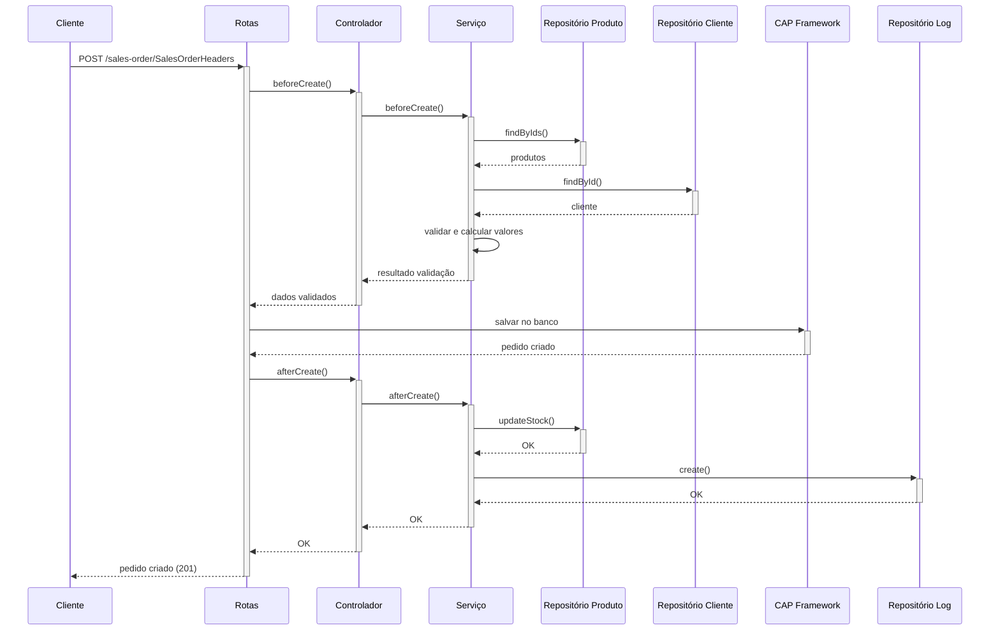
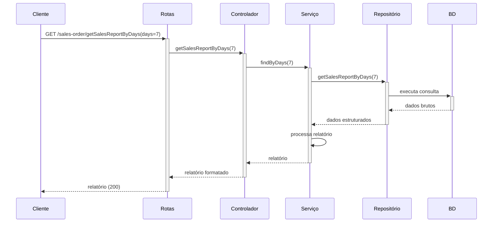
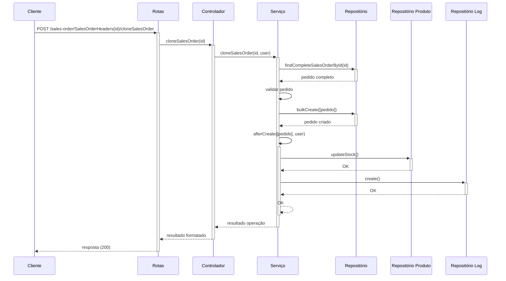

# Arquitetura e Fluxo de Dados

Este documento detalha a arquitetura do sistema de pedidos de vendas e os principais fluxos de dados entre os componentes.

## Visão Arquitetural

O sistema segue uma arquitetura em camadas com forte separação de responsabilidades. Cada componente tem uma responsabilidade bem definida e se comunica com outros componentes através de interfaces claras.

### Diagrama de Componentes

```
┌─────────────────────────────────────┐
│            Cliente HTTP             │
└───────────────────┬─────────────────┘
                    │
┌───────────────────▼─────────────────┐
│         SAP CAP Framework           │
└───────────────────┬─────────────────┘
                    │
┌───────────────────▼─────────────────┐
│              Rotas (CDS)            │
└───────────────────┬─────────────────┘
                    │
┌───────────────────▼─────────────────┐
│           Controladores             │
└───────────────────┬─────────────────┘
                    │
┌───────────────────▼─────────────────┐
│              Serviços               │
└─┬─────────────────┬─────────────────┘
  │                 │
┌─▼─────────┐     ┌─▼─────────────────┐
│ Modelos   │     │   Repositórios    │
└───────────┘     └─┬─────────────────┘
                    │
┌───────────────────▼─────────────────┐
│       Camada de Persistência        │
└───────────────────┬─────────────────┘
                    │
┌───────────────────▼─────────────────┐
│            Banco de Dados           │
└─────────────────────────────────────┘
```

## Descrição dos Componentes

### 1. SAP CAP Framework

Fornece a infraestrutura base para a aplicação, incluindo:
- Processamento de requisições HTTP
- Roteamento inicial
- Gestão de conexões com banco de dados
- Segurança e autenticação base

### 2. Rotas (CDS)

Definidas em arquivos `.cds`, estas rotas:
- Expõem entidades como serviços REST
- Definem ações e funções personalizadas
- Configuram middlewares de pré e pós-processamento
- Implementam verificações de autorização básicas

### 3. Controladores

Implementados em TypeScript, são responsáveis por:
- Receber requisições da camada de rotas
- Validar dados de entrada
- Orquestrar chamadas a serviços
- Formatar respostas para o cliente

### 4. Serviços

Contêm a lógica de negócio principal:
- Validações complexas (ex: verificação de estoque)
- Cálculo de valores (ex: totais de pedidos)
- Coordenação de operações em múltiplos repositórios
- Implementação de regras de negócio

### 5. Modelos

Representam entidades de negócio com:
- Estrutura de dados definida
- Validações específicas de entidade
- Comportamentos encapsulados (ex: cálculo de descontos)
- Transformações de dados

### 6. Repositórios

Abstraem o acesso ao banco de dados:
- Operações CRUD
- Consultas personalizadas
- Transações
- Mapeamento entre modelos e estruturas de banco de dados

### 7. Camada de Persistência

Fornecida pelo CAP, gerencia:
- Conexões com bancos de dados
- Mapeamento ORM
- Migrações de esquema
- Caching

## Principais Fluxos de Dados

### 1. Criação de Pedido de Venda



### 2. Consulta de Relatório de Vendas



### 3. Clonagem de Pedido



## Principais Modelos de Dados

### Diagrama de Entidade-Relacionamento Simplificado

```
┌─────────────────┐       ┌─────────────────┐
│    Customers    │       │ SalesOrderStatus│
│                 │       │                 │
│ - id            │       │ - id            │
│ - firstName     │       │ - description   │
│ - lastName      │       │                 │
│ - email         │       └────────┬────────┘
└────────┬────────┘                │
         │                         │
         │ 1                       │ 1
         │                         │
         │ *                       │ *
┌────────▼────────┐       ┌────────▼────────┐
│SalesOrderHeaders│       │  SalesOrderLogs │
│                 ├───────┤                 │
│ - id            │ 1   * │ - id            │
│ - totalAmount   │       │ - userData      │
│ - createdAt     │       │ - orderData     │
│ - modifiedAt    │       │                 │
└────────┬────────┘       └─────────────────┘
         │ 1
         │
         │ *
┌────────▼────────┐
│ SalesOrderItems │       ┌─────────────────┐
│                 │       │     Products    │
│ - id            │       │                 │
│ - quantity      ├───────┤ - id            │
│ - price         │ *   1 │ - name          │
│                 │       │ - price         │
└─────────────────┘       │ - stock         │
                          └─────────────────┘
```

## Considerações de Segurança

O sistema implementa múltiplas camadas de segurança:

1. **Autenticação**: Via SAP XSSec/JWT
2. **Autorização**: 
   - Verificação de papéis em nível de rota
   - Permissões granulares para operações de leitura e escrita
3. **Validação de entrada**:
   - Em controladores
   - Em serviços 
   - Em modelos
4. **Auditoria**:
   - Logs detalhados de operações
   - Rastreamento de mudanças

## Considerações de Performance

- Uso de índices adequados no banco de dados
- Operações em lote para processamento eficiente
- Validação prévia de operações para reduzir transações desnecessárias
- Estrutura modular para facilitar otimizações específicas 